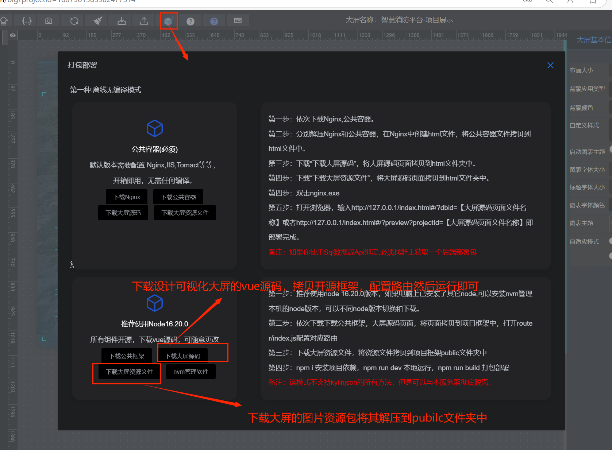

<div align="center"><h1>简搭云可视化大屏设计</h1></div>
<div align="center"><h3>可导出源码,离线免费部署框架vue2.0版本</h3></div>

<div align="center">

[](https://gitee.com/liuyaping007/bigscreen/stargazers)
[](https://gitee.com/liuyaping007/bigscreen/members)
[](https://gitee.com/dotnetchina/Furion/blob/master/LICENSE)

</div>

### 🏆简搭云可视化大屏设计：高效、灵活、全面

简搭云可视化大屏设计器是一款功能强大、灵活易用的数据可视化工具，专为高效展示复杂数据而设计。集成2万+ ECharts组件、全国41636个乡镇地图GeoJson、DataV组件及20个Canvas动画背景，采用Element UI框架开发，支持在线设计、源码下载与二次开发，满足多样化需求。

#### **核心优势：**

1. **海量组件，轻松上手**  
   内置2万+ ECharts组件，无需深入掌握ECharts技术，即可快速创建各类统计报表与数据图表。

2. **全国地图全覆盖**  
   独家提供全国41636个乡镇地图GeoJson，覆盖34个省、344个市、3020个区县，满足精细化地理数据展示需求。

3. **界面优雅，体验流畅**  
   仿阿里DataV风格设计，界面大气美观，操作流畅，提升用户视觉与交互体验。

4. **动态渲染，灵活扩展**  
   基于Vue源码动态渲染，支持在线设计、本地下载与二次开发，为数据动态绑定与功能扩展提供强大支持。

5. **离线部署，安全可靠**  
   支持大屏设计源码本地下载，实现离线部署，保障数据安全与系统稳定性。

#### **适用场景：**
- 数据监控与指挥中心
- 企业数据可视化展示
- 政府与公共信息平台
- 教育与科研数据呈现

简搭云可视化大屏设计器，以高效、灵活、全面的特性，助力用户轻松打造专业级数据可视化大屏。

#### **相关文档和体验地址：**
文档地址：[http://doc.kyform.cn/](http://doc.kyform.cn/)

设计地址：[http://bg.kyform.cn/](http://bg.kyform.cn/)

体验例子：[http://doc.kyform.cn/bigtemplatelist](http://doc.kyform.cn/bigtemplatelist/)

码云离线部署vue2.0版本 [https://gitee.com/kyform/bigscreen](https://gitee.com/kyform/bigscreen)

码云离线部署vue3.0版本 [https://gitee.com/kyform/bgkyform-vue3](https://gitee.com/kyform/bgkyform-vue3)

github部署vue2.0版本 [https://github.com/liuyaping007/bgkyform](https://github.com/liuyaping007/bgkyform)

3D例子：[http://doc.kyform.cn/three3d](http://doc.kyform.cn/three3d/)

### 简搭云可视化大屏使用指南

#### 第一步：**注册账号**
1. 打开[简搭云官网](http://bg.kyform.cn/)，点击“使用 Gitee 账号 Star，免密登录”按钮，一键登录

#### 第二步：**在线设计**
1. 登录后，进入“我的大屏”模块。
2. 选择从"大屏市场"复制模板或从零开始设计，拖拽组件进行布局和配置。

#### 第三步：**下载本项目**
1. 设计完成后，点击“下载大屏源码”和“下载资源文件”按钮，
   
   

#### 第四步：**拷贝到对应文件夹中**
2. 将下载的大屏源码解压到项目工作目录的view文件夹。
3. 将下载资源文件解压到项目工作目录的public文件夹

#### 第五步：**配置路由**
1. 打开项目中的路由配置文件（`router/index.js`）。
2. 根据项目需求，配置页面路由。

#### 第六步：**运行**
1. 打开终端，进入项目目录。
2. 运行 `npm install` 安装项目依赖，一直卡死安装不了问题解决，可以先执行`npm config set strict-ssl false` 然后安装就ok了
3. 运行 `npm run serve` 启动本地开发服务器，查看效果。
4. 开发完成后，运行 `npm run build` 编译打包项目，生成部署文件。

按照以上步骤，你就可以轻松使用简搭云创建并本地离线运行可视化大屏项目了！
### 若依前后端分离版本集成本项目的步骤
#### 第一步：下载若依分离版本前端代码 下载地址：[若依前后端分离版本](https://gitee.com/y_project/RuoYi-Vue/repository/archive/master.zip)
#### 第二步：先拷贝本项目的“src\components”下的所有文件 复制到若依框架的“src\components”目录中。
#### 第三步：打开若依前端的src/main.js 文件复制如下代码：
```
import dataV from "@jiaminghi/data-view";
import bgkyform from "bgkyform-ui";
import "bgkyform-ui/bgkyform-ui.css"; // 引入打包后的组件库
import myechart from "@/components/echart/index.vue";
import baseechart from "@/components/echart/baseechart.vue";
Vue.use(dataV);
Vue.use(bgkyform);
Vue.component("myechart", myechart);
Vue.component("baseechart", baseechart);
```
粘贴到src/main.js 文件中

#### 第四步：安装相关的依赖，具体案例例子请移步到qq沟通群中 可下载对应例子
#### 第五步：具体大屏项目离线部署请参考【简搭云可视化大屏使用指南】
## 🏆 交流与支持

我们提供多种联系方式，方便您随时与我们沟通，获取帮助或加入社区讨论。

### 联系方式
- **QQ 联系人**：329175905
- **微信号**：18670793619
- **QQ 群**：
   - 1群：109434403（已满）
   - 2群：467810261

### 扫码加好友或入群
| 微信 | QQ | QQ群 |
|------|----|------|
|  |  |  |

**温馨提示**：
- 扫码添加微信或QQ时，请备注“简搭云”以便快速通过。
- 加入QQ群后，请遵守群规，共同维护良好的交流环境。

期待与您交流，一起探索更多可能！ 🚀”

### ** 优秀大屏设计例子：**

所有例子本地下载部署地址 [https://gitee.com/kyform/bigscreen](https://gitee.com/kyform/bigscreen)

##### 推荐大屏1
[](http://dt.kyform.cn/#/?dbid=1892037591235096577)

##### 推荐大屏2
[](http://dt.kyform.cn/#/?dbid=1892082517599600642)

##### 推荐大屏3
[](http://dt.kyform.cn/#/?dbid=1892083962004652034)

##### 推荐大屏4
[](http://dt.kyform.cn/#/?dbid=1892037591235096578)

##### 推荐大屏5
[](http://dt.kyform.cn/#/?dbid=1810224369834995714)

##### 推荐大屏6
[](http://dt.kyform.cn/#/?dbid=1886944959441989634)

##### 推荐大屏7
[](http://dt.kyform.cn/#/?dbid=1889206385174966273)

##### 推荐大屏8
[](http://dt.kyform.cn/#/?dbid=1889556284483629057)

##### 推荐大屏9
[](http://dt.kyform.cn/#/?dbid=1889557345705455618)

##### 推荐大屏10
[](http://dt.kyform.cn/#/?dbid=1889602946748968961)

##### 推荐大屏11
[](http://dt.kyform.cn/#/?dbid=1889906945603727362)

##### 推荐大屏12
[](http://dt.kyform.cn/#/?dbid=1890206481131827201)

##### 推荐大屏13
[](http://dt.kyform.cn/#/?dbid=1890208613306265602)

##### 推荐大屏14
[](http://dt.kyform.cn/#/?dbid=1890209569594994689)

##### 推荐大屏15
[](http://dt.kyform.cn/#/?dbid=1890216083386855426)

##### 推荐大屏16
[](http://dt.kyform.cn/#/?dbid=1890216744203644929)

##### 推荐大屏17
[](http://dt.kyform.cn/#/?dbid=1890221606920318977)

##### 推荐大屏18
[](http://dt.kyform.cn/#/?dbid=1890225842945060865)

##### 推荐大屏19
[](http://dt.kyform.cn/#/?dbid=1890230283618283521)

##### 推荐大屏20
[](http://dt.kyform.cn/#/?dbid=1890247897602125826)

##### 推荐大屏21
[](http://dt.kyform.cn/#/?dbid=1890248339526578177)

##### 推荐大屏22
[](http://dt.kyform.cn/#/?dbid=1890280663660163074)

##### 推荐大屏23
[](http://dt.kyform.cn/#/?dbid=1891423518520832001)

##### 推荐大屏24
[](http://dt.kyform.cn/#/?dbid=1891666281736761346)

##### 推荐大屏25
[](http://dt.kyform.cn/#/?dbid=1892082874081886209)

##### 推荐大屏26
[](http://dt.kyform.cn/#/?dbid=1892083775744000001)

